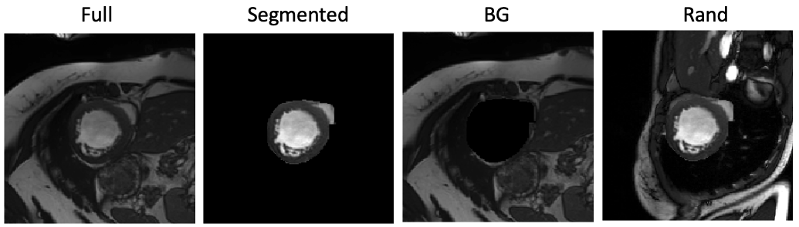

# Reducing Contextual Bias in CMR - MLHC 2023


### Reducing Contextual Bias in Cardiac Magnetic Resonance Imaging Deep Learning Using Contrastive Self-Supervision [[Paper]]() 

<p align="center">
  
</p>
Example CMR images separating object of interest from background

## Datasets
- ACDC dataset can be downloaded from the original website: https://www.creatis.insa-lyon.fr/Challenge/acdc/databases.html

## Citation
 we kindly ask that you reference our paper if you find our code is beneficial to your research
```
@inproceedings{makiya_contextualbias_2023,
  title     = {Reducing Contextual Bias in Cardiac Magnetic Resonance Imaging Deep Learning Using Contrastive Self-Supervision},
  author    = {Makiya Nakashima,
               Donna Salem,
               HW Wilson Tang,
               Christopher Nguyen,
               Tae Hyun Hwang,
               Ding Zhao,
               Byung-Hak Kim,
               Deborah Kwon and
               David Chen },
  booktitle={Machine Learning for Healthcare 2023},
  url       = {},
  year      = {2023},
}
```
